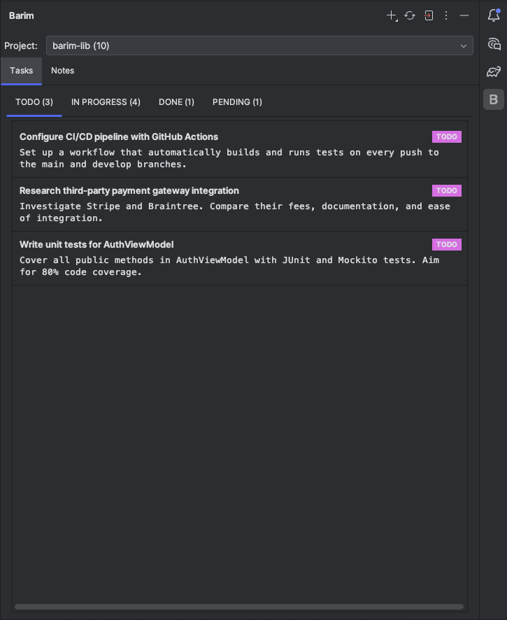
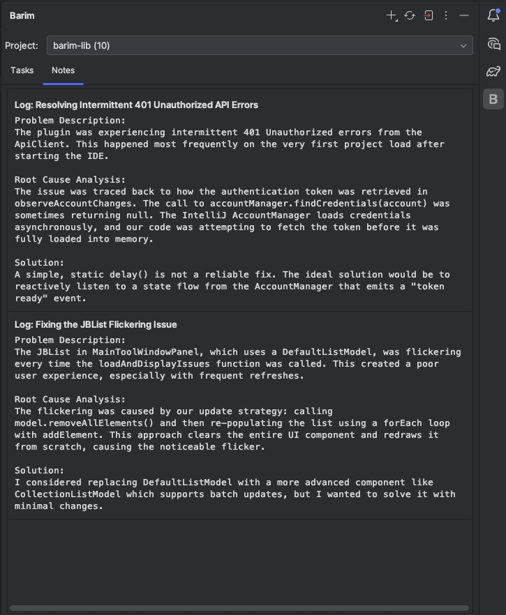
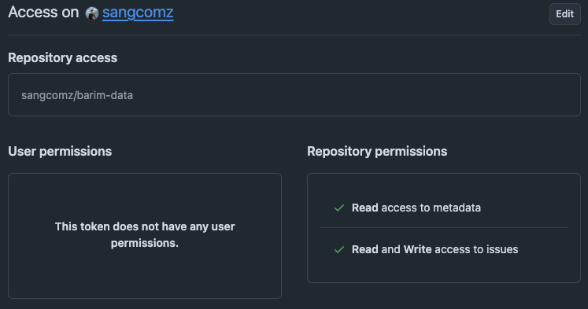

[English](./README.md)

# Barim

**Barim**은 코딩 프로젝트를 위한 개인적인 할 일과 아이디어를 IDE 안에서 직접 관리할 수 있도록 도와주는 IntelliJ 플러그인입니다. 모든 데이터는 당신의 GitHub 계정에 있는 `barim-data` 저장소에 이슈(Issues) 형태로 안전하게 저장됩니다.

***

## 주요 기능

* **IDE 통합 관리**: 코딩 흐름을 벗어나지 않고 할 일과 노트를 관리할 수 있습니다.
* **GitHub 기반**: 당신의 GitHub 계정이 개인 데이터베이스가 됩니다. 모든 데이터는 GitHub 이슈로 저장되어 안전하게 동기화됩니다.
* **칸반 보드**: `TODO`, `IN PROGRESS`, `DONE`, `PENDING` 상태를 통해 작업을 체계적으로 추적하고 관리할 수 있습니다.
* **태그 시스템**: 노트에 태그를 추가하여 아이디어를 쉽게 분류하고 검색할 수 있습니다.

***

## 스크린샷

| Tasks                               | Notes                               |
| ----------------------------------- | ----------------------------------- |
|  |  |

## 시작 전 필수 요건

Barim을 사용하기 위해서는 **두 가지**를 미리 준비해야 합니다.

### 1. 'barim-data' 저장소 생성

모든 할 일과 노트는 당신의 GitHub 계정에 있는 특정 저장소에 저장됩니다.

* **저장소 이름**: 반드시 **`barim-data`** 여야 합니다.
* **공개 범위**: 개인적인 내용을 다루므로 **Private**으로 생성하는 것을 강력히 권장합니다.

> 👉 **[여기를 클릭하여 'barim-data' 저장소 바로 생성하기](https://github.com/new?name=barim-data&description=Data%20for%20the%20Barim%20IDE%20plugin.)**
> (링크 클릭 시 저장소 이름과 설명이 자동으로 채워집니다. Private으로 설정 후 생성하세요.)

### 2. GitHub Personal Access Token 설정

플러그인이 당신의 `barim-data` 저장소에 접근하려면 GitHub 토큰이 필요합니다. 보안을 위해 최소한의 권한만 가진 **Fine-grained personal access token** 사용을 권장합니다.

토큰 생성 시 아래와 같이 권한을 설정해주세요.

* **Repository access**: `Only select repositories`를 선택하고, 위에서 생성한 `barim-data` 저장소를 지정합니다.
* **Permissions**: **Repository permissions** 항목에서 아래와 같이 설정합니다.
  * `Issues`: **Read and Write** 로 설정합니다. (필수)
  * `Metadata`: **Read-only** 로 설정합니다. (필수)

위 스크린샷과 같이 **Issues**와 **Metadata**에 대한 권한만 필요하며, 그 외 다른 권한은 설정할 필요가 없습니다.

***

## 🚀 사용 방법

1.  IntelliJ **Marketplace**에서 **Barim** 플러그인을 설치합니다.
2.  IDE 우측의 Tool Window에서 **Barim**을 엽니다 (`View > Tool Windows > Barim`).
3.  `Login with GitHub` 버튼을 클릭하여 위에서 생성한 **Personal Access Token**으로 로그인합니다.
4.  로그인이 완료되면 자동으로 `barim-data` 프로젝트를 불러옵니다.
5.  이제 `Add` 버튼을 눌러 첫 할 일(Task)이나 노트(Note)를 추가해보세요!